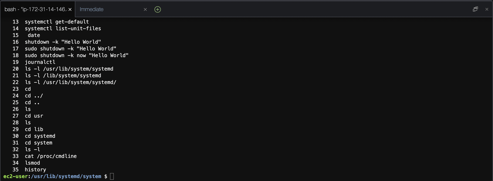

## 20220211の学習内容
システムアーキテクチャの章を中心に復習した。 
- default.targetをrunlevel3.targetにしても何も変わらなかった。runlevel1.targetにしたらフリーズした。
- systemdでは、システムの起動処理はUnitと呼ばれる処理単位に分かれている。
- targetは複数のUnitをグループ化したUnit。timerは指定した日時や間隔で処理を実行するUnit。

### 今日のコマンド
