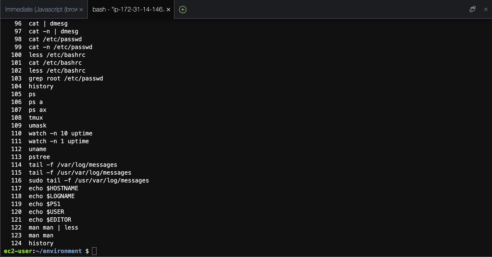

## 20220212の学習内容
LPIC コマンドの章を中心に復習した。 
- シェルには補完機がある。Tabキーを押すと残りの部分が自動的に補完される。
- Ctrl＋AとCtrl＋Eでカーソルを移動できる。Ctrl＋Lは画面をクリアしてカレント行を再表示できて便利。
- ＾と＃はbashシェルのメタキャラクタとして解釈されないので、grepコマンド中で引用符で括らなくても良い。
- manではデフォルトのページャとしてlessが設定されている。

### 今日のコマンド
