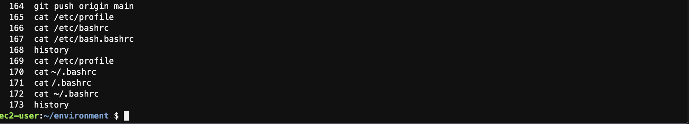
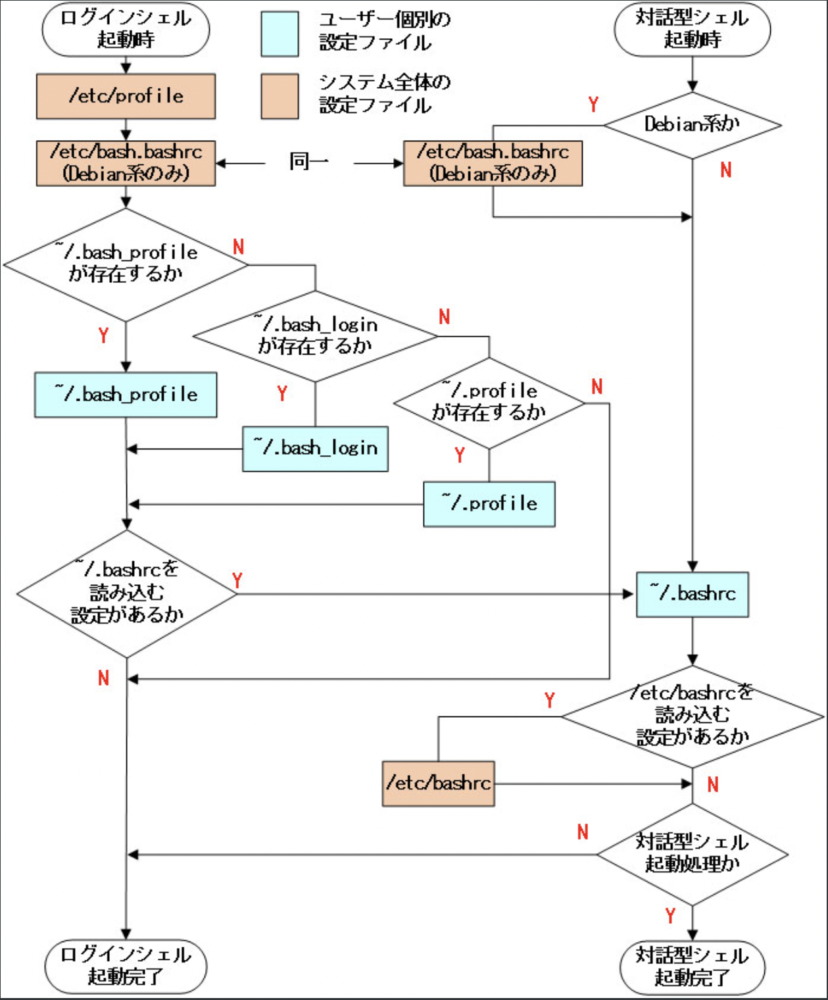

## 20220214の学習内容
LPIC bashの設定ファイルを中心に復習した。 
- /etc/profileはbashのログイン時に実行される。基本的な環境変数などが設定される。
- ~/.bash_profileは、そのユーザー独自の設定を行う。ログイン時に実行される。
- ~/.bashrcは対話型シェルが起動されるたびに実行される。全ユーザに対する設定は/etc/bashrcに記述し、/.bashrcから呼び出すようになっている。

### 今日のコマンド

